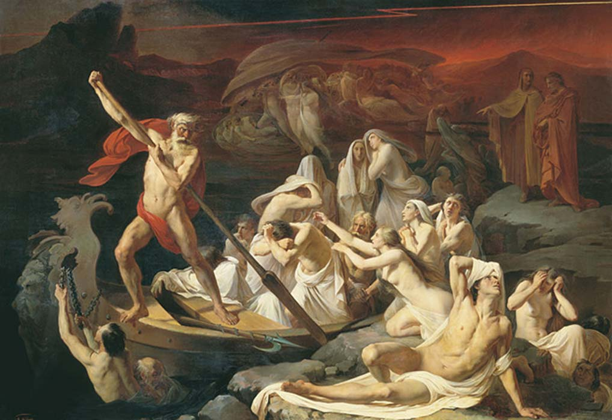

# rscy-biz

servin' up RSCs since 2024

## The Plan:
- serve up file `gates-of-rsc.js`
- within this `gates-of-rsc` we shall mount our `rscy-biz` react shenanigans on a page of `the-dopness` <-- doin
- within these react shenani walls there lives a lil rscy baby hittin' that sweet db from the client, dog

## Later Things:
- fix dev environment
  - need to hot re-build the `gates-of-rsc` and re-serve it from `rscy-world`
  - OR just storybook (but what about the server stuff?)
  - OR develop against playwright e2e tests
- replace vite dev server w/ storybook

#### __the gates of rsc__
real-world architectural diagram&#8482;:

